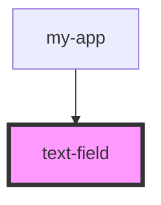

# text-field

<!-- Auto Generated Below -->

## Properties

| Property | Attribute | Description                           | Type     | Default     |
| -------- | --------- | ------------------------------------- | -------- | ----------- |
| `text`   | `text`    | The text to display as an h1 element. | `string` | `undefined` |

## Dependencies

### Used by

 - [my-app](../..)

### Graph

----------------------------------------------

*Built with [StencilJS](https://stenciljs.com/)*
